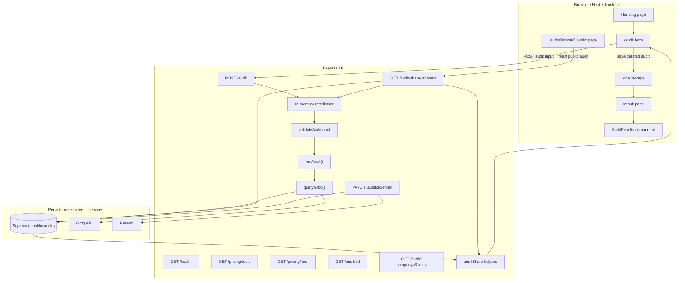

# Architecture - CredX AI Spend Audit

This document describes the architecture that is currently implemented in this repo.

The product has three user-facing paths:

1. `/` is the landing page.
2. `/audit` collects tool spend inputs and submits them to the backend.
3. `/result` and `/audit/[shareId]` render saved audit results.

The core audit computation now runs on the backend, not in the browser.

---

## Stack

| Layer | Current choice | Notes |
| --- | --- | --- |
| Frontend | Next.js 14 App Router + React 18 + TypeScript | UI, result rendering, share page fetching |
| Styling | Tailwind CSS v4 | Utility styling across app pages and components |
| Backend | Express on Node.js | API for pricing, audit creation, email capture, and public share fetch |
| Database | Supabase Postgres | Stores audit input, audit result JSON, share IDs, and optional email |
| LLM summary | Groq via OpenAI-compatible SDK | `openai/gpt-oss-20b` through `backend/src/lib/groq.js` |
| Email | Resend | Sends report link after `/audit/:id/email` |
| Tests | Node built-in test runner | Audit engine coverage in `backend/test/auditEngine.test.js` |

---

## System Diagram

---

## Request Flow

### 1. Audit creation

1. The user opens `/audit`.
2. `AuditForm` renders tool and plan options from `frontend/src/lib/pricingData.ts`.
3. Form state is persisted in browser `localStorage`:
   - `spendlens_tools`
   - `spendlens_teamsize`
   - `spendlens_usecase`
4. On submit, the frontend sends `POST /audit` to the Express API using `NEXT_PUBLIC_API_BASE_URL`.
5. Backend middleware applies:
   - in-memory rate limiting: 10 requests per 10 minutes per IP
   - request validation for `tools`, `teamSize`, and `primaryUseCase`
6. `runAudit()` computes:
   - tool cost breakdown
   - cheaper-plan recommendations
   - annual billing suggestions
   - excess seat waste
   - overlap across coding and general AI tools
7. `queryGroq()` generates a summary paragraph from the structured audit result.
8. The backend inserts the full audit into Supabase with a generated `share_id`.
9. The API responds with:
   - database `id`
   - `shareId`
   - `shareUrl`
   - `createdAt`
   - computed `result`
   - `llmSummary`
10. The frontend stores the result in `localStorage` under `spendlens_audit_result` and redirects to `/result`.

### 2. Private result rendering

1. `/result` reads `spendlens_audit_result` from `localStorage`.
2. `AuditResults` renders summary stats, recommendations, breakdown rows, and the LLM summary.
3. The user can:
   - copy the share link
   - export the report as a client-generated `.html` file
   - submit an email address for delivery

### 3. Email capture

1. The result page calls `PATCH /audit/:id/email`.
2. The backend updates the matching row in Supabase.
3. `sendAuditResultEmail()` sends a Resend email containing the share URL.
4. Email send failures are logged, but they do not fail the PATCH response after the DB update succeeds.

### 4. Public share page

1. A public URL is generated in the form `/audit/{shareId}` using `PUBLIC_URL`.
2. The Next.js page at `/audit/[shareId]` fetches backend data from `GET /audit/share/:shareId`.
3. The backend returns:
   - public audit fields
   - result payload
   - an `openGraph` preview object
4. The share page renders `AuditResults` in `public` mode, which hides the email capture block.

---

## Frontend Structure

### Pages

| Route | Role |
| --- | --- |
| `/` | Marketing landing page |
| `/audit` | Audit input UI and submission |
| `/result` | Private result view loaded from local storage |
| `/audit/[shareId]` | Server-rendered public report page |

### Key components

| Component | Role |
| --- | --- |
| `Auditform.tsx` | Collects tool inputs, team size, and use case |
| `ToolInput.tsx` | Individual tool row editing |
| `AuditResults.tsx` | Shared renderer for private and public result pages |

### Frontend data sources

The frontend currently uses two kinds of state:

- local component state for active form and result UI
- browser `localStorage` for form persistence and the latest created audit

There is also a local pricing catalog in `frontend/src/lib/pricingData.ts` used for the form UI. This is separate from the backend pricing catalog.

The backend pricing endpoints exist for API consumers and debugging, but the current frontend does not call them.

---

## Backend Structure

### Route layer

| File | Responsibility |
| --- | --- |
| `backend/src/index.js` | Express app setup, CORS, JSON parsing, route registration |
| `backend/src/routes/pricing.js` | Read-only pricing endpoints |
| `backend/src/routes/audit.js` | Audit creation, fetch, listing, sharing, email patch |

### Middleware

| File | Responsibility |
| --- | --- |
| `backend/src/middleware/validate.js` | Validates audit input shape and allowed values |
| `backend/src/middleware/rateLimiter.js` | In-memory IP-based limiter used on `POST /audit` and `GET /audit/share/:shareId` |

### Core libraries

| File | Responsibility |
| --- | --- |
| `backend/src/lib/auditEngine.js` | Audit computation and recommendation generation |
| `backend/src/lib/pricingData.js` | Backend source of truth for pricing and categories |
| `backend/src/lib/groq.js` | LLM summary request |
| `backend/src/lib/auditShare.js` | Share ID generation, share URL building, preview text |
| `backend/src/lib/email.js` | Resend email send |

---

## Persistence Model

The backend expects Supabase to be configured at startup and will throw if these env vars are missing:

- `SUPABASE_URL`
- `SUPABASE_SERVICE_ROLE_KEY`

The `public.audits` table stores:

- `id`
- `share_id`
- `is_public`
- `company_name`
- `email`
- `team_size`
- `primary_use_case`
- `input` JSONB
- `result` JSONB
- `created_at`
- `updated_at`

This means the system stores both the original request payload and the computed audit output, which keeps the public share page and future admin/reporting paths simple.

---

## External Integrations

### Groq

- Called during `POST /audit`
- Uses the OpenAI SDK with Groq's OpenAI-compatible base URL
- Model: `openai/gpt-oss-20b`
- Output is appended as `llmSummary`

Important current behavior:
If the LLM request fails, audit creation fails too. There is no fallback summary path in the current route handler.

### Resend

- Called during `PATCH /audit/:id/email`
- Sends a report-ready email with the share URL
- Errors are caught and logged inside `sendAuditResultEmail()`

---

## Environment Variables

### Backend

- `PORT`
- `PUBLIC_URL`
- `SUPABASE_URL`
- `SUPABASE_SERVICE_ROLE_KEY`
- `GROQ_API_KEY`
- `RESEND_API_KEY`
- `NODE_ENV`

### Frontend

- `NEXT_PUBLIC_API_BASE_URL`

---

## Current Architecture Notes

These are important realities of the current implementation:

### 1. The audit engine is server-side

The browser no longer computes the audit report itself. The backend is the source of truth for both the structured report and the LLM summary.

### 2. Pricing data is duplicated

There is one pricing catalog in:

- `backend/src/lib/pricingData.js`
- `frontend/src/lib/pricingData.ts`

The frontend copy powers form options, while the backend copy powers validation and audit logic. This works, but it creates drift risk.

### 3. Company name exists in the API, but not in the current form

The backend accepts `companyName`, stores it, and uses it for share metadata, but the current audit form does not submit a company name field.

### 4. Rate limiting is process-local

The limiter uses an in-memory `Map`, so limits reset on restart and do not coordinate across multiple server instances.

### 5. Public preview data exists, but Next metadata is not wired yet

`GET /audit/share/:shareId` returns an `openGraph` object, but the current Next.js share page does not define `generateMetadata()` to turn that payload into actual page metadata.

---

## Scaling Path

If this product grows, the next architectural steps are clear:

1. Move rate limiting to Redis or another shared store.
2. Unify pricing data so frontend and backend use one source.
3. Add `generateMetadata()` on `/audit/[shareId]` for real social previews.
4. Make LLM summaries best-effort instead of blocking audit creation.
5. Queue email sending and LLM work if audit volume grows.
6. Add authenticated admin/reporting views on top of the existing `GET /audit` and `GET /audit/:id` endpoints.

---

## Testing and CI

The audit engine currently has automated coverage in `backend/test/auditEngine.test.js`, and CI runs:

- frontend lint via `npm --prefix frontend run lint`
- backend tests via `npm --prefix backend test`

This keeps the core recommendation logic protected as pricing and route behavior evolve.
