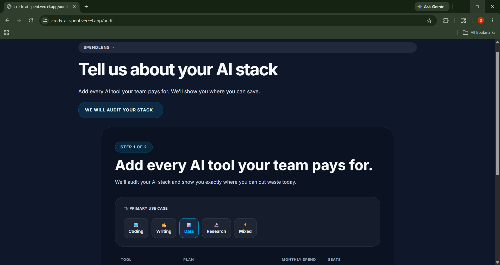
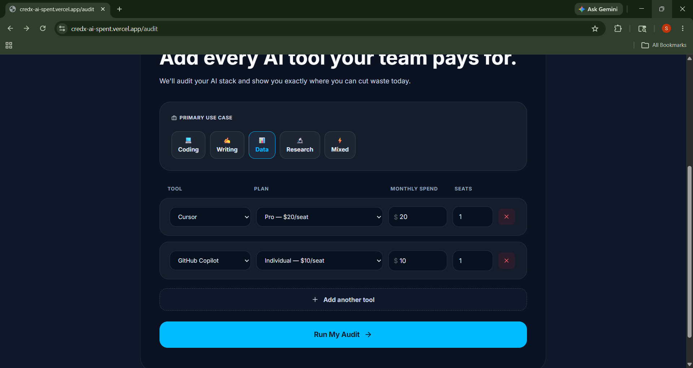
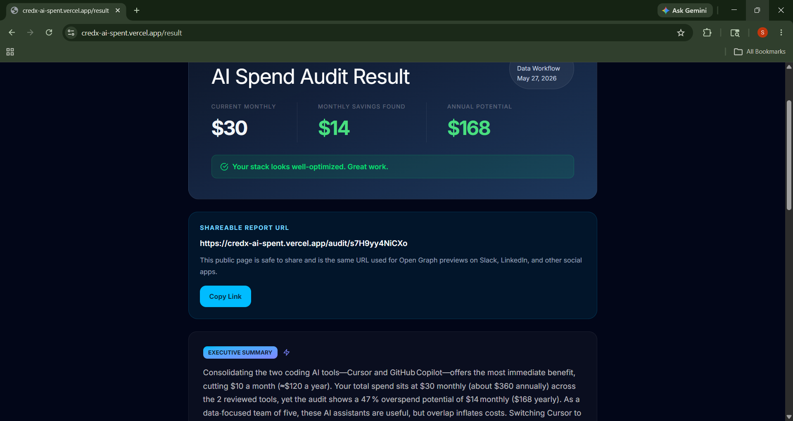
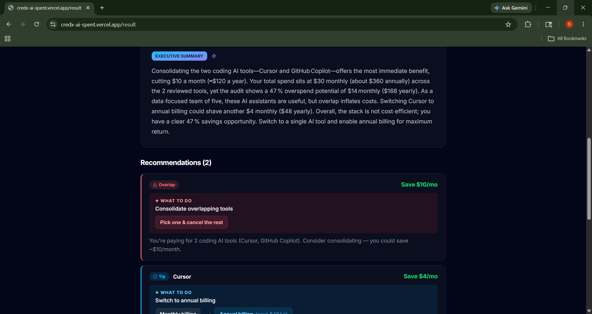
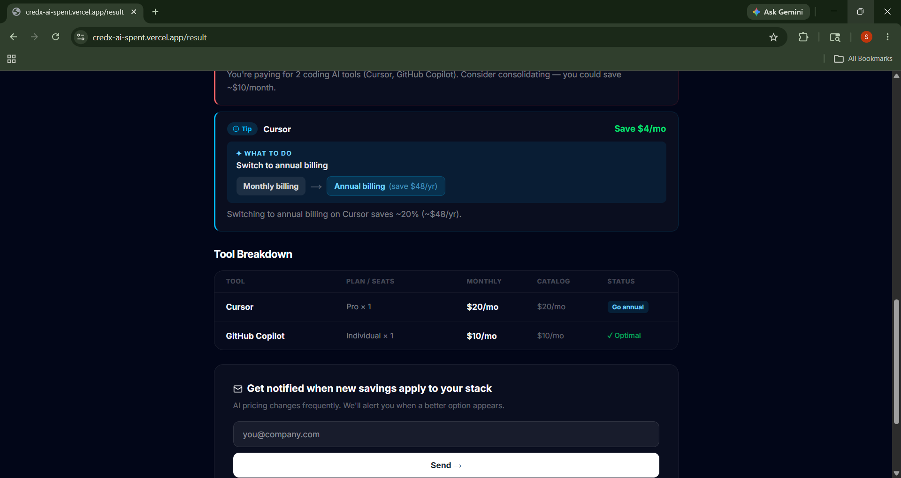

# AI Spend Auditor

A full-stack tool for teams to audit AI software spend, uncover wasted seats and plan overlaps, and generate savings recommendations quickly. It is designed for finance and operations teams that want a lightweight review of their AI stack without manually comparing every subscription.

## Screenshots













## Quick Start

```bash
npm install --prefix backend
npm install --prefix frontend
npm --prefix backend run dev
npm --prefix frontend run dev
```

Open `http://localhost:3000` after starting the frontend. The backend runs on `http://localhost:4000`.

## Deploy

1. Deploy the frontend to Vercel or another Next.js host.
2. Deploy the backend to a Node host or serverless environment.
3. Set `NEXT_PUBLIC_API_BASE_URL` to your deployed backend URL.
4. Configure Supabase and Groq credentials in `backend/.env`.

## Decisions

- Used Next.js + React for a modern, production-ready frontend.
- Kept the audit engine in backend Node so recommendations are testable and isolated.
- Stored audit history in Supabase for shareable reports and persistence.
- Used Node built-in tests to avoid extra dev-dependency overhead.
- Removed the explicit team-size input but kept a default team size so the form stays simple.

## Tests

Backend audit engine tests are in `backend/test/auditEngine.test.js`.
Run them with:

```bash
npm --prefix backend test
```

## CI

The GitHub Actions workflow at `.github/workflows/ci.yml` runs on pushes to `main` and pull requests targeting `main`.
It executes:

- `npm run lint` in `frontend`
- `npm test` in `backend`

## Deployed URL

https://credx-ai-spent.vercel.app/
